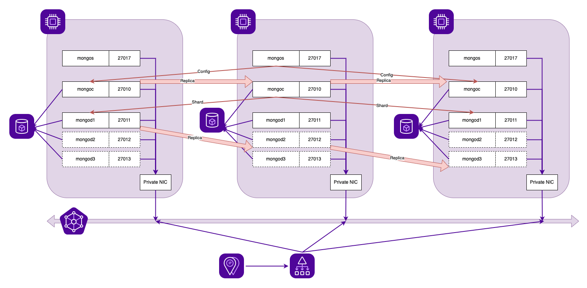

demo-ansible-terraform
======================

This demonstrate the usage of Terraform in an Ansible playbook to easily create idempotent complex infrastructure (instead of using the Scaleway Ansible Provider) and using Ansible in one go with in memory inventory to install a full app on all instances (instead of using per instance playbook when using Ansible provider in Terraform).

The demonstration application installed is a MongoDB cluster (shards + replica). Each shard is replicated on the next two instances created, the config cluster is replicated on all instances and a loadbalancer is connected to all the mongos on the instances.




Limits
------

This demonstrate the whole process but IT IS NOT production-ready:
- no ACL on loadbalancer frontend
- no monitoring whatsoever
- all bases (4 per nodes) are on the same block volume instead of their own block volume
- it does not handle reconfiguration when scaling up

Prerequisites
-------------

- Install Terraform, Ansible and GNU Make for example:

```
brew install terraform
brew install ansible
brew install make
```

- Create Scaleway API key and add environment variables:

```
export SCW_ACCESS_KEY="<ACCESS KEY>"
export SCW_SECRET_KEY="<SECRET KEY>"
export SCW_DEFAULT_PROJECT_ID="<PROJECT KEY>"
```

- Handle ssh connection to known hosts in case of replay

```
cat /etc/ssh/ssh_config | grep -i strict
        StrictHostKeyChecking no
```

Basic Usage
-----------

To build the whole infrastructure, just execute make with an optional odd scale (default 3):

```
make SCALE=3

(...snip...)

TASK [Display connection method] *******************************************
ok: [srv-0.private] => {
    "msg": "mongo -u admin -p scaleway \"51.159.27.240:27017/test\" --shell"
}

```

To connect on the MongoDB base, use the provided connection method (both admin and test bases use the same login).

```
$ mongo -u admin -p scaleway "51.159.27.240:27017/admin" --shell

MongoDB shell version v3.6.23
connecting to: mongodb://51.159.27.240:27017/admin?gssapiServiceName=mongodb
Implicit session: session { "id" : UUID("4004d7c6-3865-4179-989f-142a23c86a8c") }
MongoDB server version: 3.6.8
type "help" for help

mongos> sh.status()
--- Sharding Status ---
  sharding version: {
  	"_id" : 1,
  	"minCompatibleVersion" : 5,
  	"currentVersion" : 6,
  	"clusterId" : ObjectId("63c8f68a9f6cc616983cf831")
  }
  shards:
        {  "_id" : "srv-0.private",  "host" : "srv-0.private/srv-0.private:27011,srv-1.private:27012,srv-2.private:27013",  "state" : 1 }
        {  "_id" : "srv-1.private",  "host" : "srv-1.private/srv-0.private:27013,srv-1.private:27011,srv-2.private:27012",  "state" : 1 }
        {  "_id" : "srv-2.private",  "host" : "srv-2.private/srv-0.private:27012,srv-1.private:27013,srv-2.private:27011",  "state" : 1 }
  active mongoses:
        "3.6.8" : 3
  autosplit:
        Currently enabled: yes
  balancer:
        Currently enabled: yes
        Currently running: no
        Failed balancer rounds in last 5 attempts: 0
        Migration results for the last 24 hours:
                2 : Success
  databases:
        {  "_id" : "config",  "primary" : "config",  "partitioned" : true }
                config.system.sessions
                        shard key: { "_id" : 1 }
                        unique: false
                        balancing: true
                        chunks:
                                srv-0.private	1
                        { "_id" : { "$minKey" : 1 } } -->> { "_id" : { "$maxKey" : 1 } } on : srv-0.private Timestamp(1, 0)
        {  "_id" : "test",  "primary" : "srv-0.private",  "partitioned" : true }
                test.messages
                        shard key: { "createTime" : 1 }
                        unique: false
                        balancing: true
                        chunks:
                                srv-0.private	1
                        { "createTime" : { "$minKey" : 1 } } -->> { "createTime" : { "$maxKey" : 1 } } on : srv-0.private Timestamp(1, 0)
                test.user
                        shard key: { "_id" : "hashed" }
                        unique: false
                        balancing: true
                        chunks:
                                srv-0.private	2
                                srv-1.private	2
                                srv-2.private	2
                        { "_id" : { "$minKey" : 1 } } -->> { "_id" : NumberLong("-6148914691236517204") } on : srv-0.private Timestamp(3, 2)
                        { "_id" : NumberLong("-6148914691236517204") } -->> { "_id" : NumberLong("-3074457345618258602") } on : srv-0.private Timestamp(3, 3)
                        { "_id" : NumberLong("-3074457345618258602") } -->> { "_id" : NumberLong(0) } on : srv-1.private Timestamp(3, 4)
                        { "_id" : NumberLong(0) } -->> { "_id" : NumberLong("3074457345618258602") } on : srv-1.private Timestamp(3, 5)
                        { "_id" : NumberLong("3074457345618258602") } -->> { "_id" : NumberLong("6148914691236517204") } on : srv-2.private Timestamp(3, 6)
                        { "_id" : NumberLong("6148914691236517204") } -->> { "_id" : { "$maxKey" : 1 } } on : srv-2.private Timestamp(3, 7)
```

To destroy the whole infrastructure, use make dist-clean

```
make dist-clean
```

Folder structure
----------------

Ansible executes the Terraform "project" in the folder ```terraform``` and then install the MongoDB role from folder ```roles/mongodb```

```
$ tree .
.
├── Makefile
├── destroy.yml
├── execute.yml
├── roles
│   └── mongodb
└── terraform
```

Terraform manifest is based on this [repository](https://github.com/n-Arno/scaleway-terraform-example). Upgrading it by using modules is left as an exercice. 😁

A custom jinja2 filter is provided in the MongoDB role to find adjacent nodes for the shards replicas.

```
$ cat roles/mongodb/filter_plugins/filters.py
class FilterModule(object):
    def filters(self):
        return {
            'move_in_list': move_in_list
        }

def move_in_list(instances, instance, delta):
    """
    Get an element in list using delta position from a reference element. Circle back to start or end if getting out of list
    """
    i = instances.index(instance)
    l = len(instances)
    r = i + delta
    if r<0:
        return instances[r+l]
    elif r>=l:
        return instances[r-l]
    else:
        return instances[r]
```

The Makefile create the needed keyfile for MongoDB before executing the playbook. The MongoDB admin password can be provided as an extra var to ansible (mongo_admin_pass)

The MongoDB role is heavily customized but based on [this repository](https://github.com/twoyao/ansible-mongodb-cluster). It uses mongodb 3.6.8 to use a pre SSPL version.
